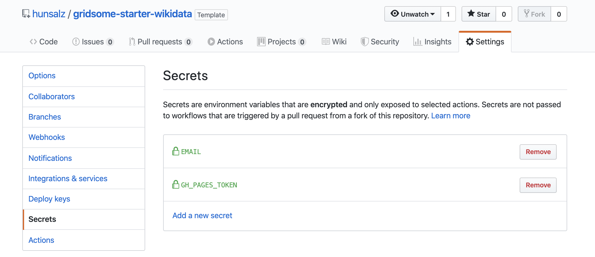

# Gridsome Starter Wikidata

This is a boilerplate starter, aiming to showcase how Gridsome and an external data source (e.g. Wikidata) can nicely work together.

## Demo URL

https://hunsalz.github.io/gridsome-starter-wikidata

## Features
- Using [Wikidata](https://www.wikidata.org/) as external data source
- Download of external media data
- Use of GitHub actions CI/CD pipeline
- Grid layout
- Tag & favorite filter
- Dark / light mode
- CSS variables, SCSS & BEM for styling
- 100, 100, 100, 100, (100) score on Google Lighthouse

## Install

### 1. Install Gridsome CLI tool if you don't have already

`npm install --global @gridsome/cli`

### 2. Install starter

1. `gridsome create my-gridsome-site https://github.com/hunsalz/gridsome-starter-wikidata.git`
2. `cd my-gridsome-site` to open folder
3. `gridsome develop` to start local dev server at `http://localhost:8080`

## Setup GitHub Pages deploy

**Note**: By default GitHub Pages deploy isn't active. 

GitHub Pages deploy needs two secrets to be set properly: Your mail address: *EMAIL* and your GitHub token: *GH_PAGES_TOKEN*.

As mail address you can simply use [your commit email address on GitHub](https://help.github.com/en/github/setting-up-and-managing-your-github-user-account/setting-your-commit-email-address#setting-your-commit-email-address-on-github)

Find documentation how to generate personal access tokens [here](https://help.github.com/en/github/authenticating-to-github/creating-a-personal-access-token-for-the-command-line#creating-a-token).

Finally you should have the following secrets available in your project:

## Development support

### Skip media downloads

Fetching all data, especially all media content takes a while. Why not skip media downloads if you have saved all files locally already? Nothing could be easier. Just change *DOWNLOAD_MEDIA=true* in your local *.env* file to some other value.

### Verify your local build

If you want to verify your local build you can easily mount your dist folder into a nginx container.
**Note**: Leave base dir blank if you want to run your site in root context.

> docker run --rm --name nginx-stage -p 8080:80 -v ${PWD}/dist/:/usr/share/nginx/html/gridsome-starter-wikidata:ro -d nginx:latest

Afterwards visit [http://localhost:8080/gridsome-starter-wikidata](http://localhost:8080/gridsome-starter-wikidata)
